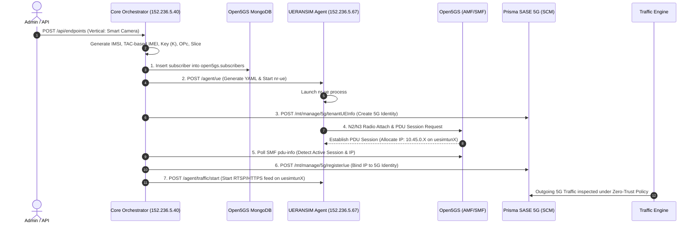

# Product Requirements Document (PRD)
# Prisma SASE 5G & Private 5G End-to-End Orchestrator

**Document Version:** 1.0 (Comprehensive Baseline)  
**Date:** October 2026  
**Author:** Jean-Louis Suzanne / Antigravity  
**Repositories:** `jsuzanne/Prisma-SASE-5G` & `jsuzanne/stigix`  
**Infrastructure Target:** Megaport VMs (5G Core: `152.236.5.40`, UERANSIM RAN: `152.236.5.67`) & Palo Alto Networks Strata Cloud Manager (SCM)

---

## 1. Executive Summary & Vision

### 1.1 The Problem
In enterprise Private 5G and Hybrid SASE deployments:
1. **Siloed Provisioning:** Security teams define 5G zero-trust identities (IMSI, IMEI, APN, Tenant Groups) in Prisma SASE 5G, while Telco/IT teams separately configure SIM credentials, QoS, and Slices in the 5G Packet Core (Open5GS/MongoDB).
2. **Manual RAN Device Staging:** Physical or emulated UEs (UERANSIM) require manual YAML generation, key management, and process launches.
3. **Session Disconnect:** When a UE establishes a PDU session, its dynamically allocated IP is not instantly bound to its SASE identity, delaying zero-trust inspection and micro-segmentation.
4. **Lack of Realistic Testing:** Demonstrating SASE security requires vertical-specific traffic (IoT sensors, CCTV video feeds, Industrial SCADA, human browsing) originating directly from individual UE tunnels (`uesimtunX`).

### 1.2 The Solution
A unified, multi-role **5G Endpoint & Traffic Orchestrator** where selecting or generating a **Vertical Device Profile** (e.g., Industrial Sensor, Connected Ambulance, Smart Camera, Human Executive) triggers a single-click, parallel orchestration across:
1. **Prisma SASE 5G**: Provisions 5G Identity, Tenant Group mapping, and Security Policy.
2. **5G Core (Open5GS)**: Provisions Subscriber document in MongoDB with cryptographic keys, QoS 5QI, AMBR rates, and S-NSSAI slice.
3. **5G RAN (UERANSIM)**: Generates device-specific YAML matching realistic TAC/IMEI ranges and launches `nr-ue` process.
4. **Dynamic IP Binding**: Polls SMF/AMF telemetry, grabs the assigned `uesimtunX` IP, and calls Prisma SASE 5G `/register/ue` API.
5. **Vertical Traffic Generator**: Spawns tailored L4/L7 application traffic directly through the UE's dedicated network interface into Prisma SASE.

```
+-----------------------------------------------------------------------------------------+
|                                    USER INTERFACE / REST API                             |
|             "Select Vertical: Smart City CCTV / Medical IoT / Human Smartphone"          |
+--------------------------------------------+--------------------------------------------+
                                             |
                   +-------------------------+-------------------------+
                   |                                                   |
                   v                                                   v
   +-------------------------------+                   +-------------------------------+
   |   5G Core VM (152.236.5.40)   |                   |  UERANSIM VM (152.236.5.67)   |
   | - Open5GS Subscriber (Mongo)  |                   | - Generate UE Config (YAML)   |
   | - S-NSSAI / 5QI QoS / AMBR    |                   | - Start nr-ue daemon          |
   | - SMF / AMF Telemetry Poller  |                   | - Allocate uesimtunX          |
   +---------------+---------------+                   +---------------+---------------+
                   |                                                   |
                   +---------------------+       +---------------------+
                                         |       |
                                         v       v
                       +-----------------------------------+
                       |    Prisma SASE 5G (Palo Alto)     |
                       | - Create 5G Identity              |
                       | - Assign Security Group & Tenant  |
                       | - Register Live Session IP        |
                       | - Enforce Zero-Trust Security     |
                       +-----------------+-----------------+
                                         ^
                                         | L4/L7 Simulated Traffic
                       +-----------------+-----------------+
                       |    Vertical Traffic Worker        |
                       | (MQTT / RTSP / Modbus / HTTPS)    |
                       +-----------------------------------+
```

---

## 2. Industry Verticals & Device Profiles

The system provides out-of-the-box templates modeling real-world 5G private network deployments:

| Vertical | Device Type | Example Device Name | TAC / IMEI Model | 5G Slice (SST/SD) | 5QI / QoS | APN / DNN | Traffic Profile |
|---|---|---|---|---|---|---|---|
| **Smart City / Surveillance** | 4K Security Camera | Axis 5G Bullet Cam | `354128...` (Axis TAC) | SST 1, SD `000001` | 5QI 4 (Non-GBR Video) | `video.5g` | RTSP stream / HTTPS video chunks |
| **Industry 4.0 / Manufacturing** | Robotic AGV / PLC | Siemens SIMATIC S7 | `863294...` (Industrial TAC) | SST 2 (URLLC), SD `000002` | 5QI 82 (Low Latency) | `factory.io` | Modbus TCP, OPC-UA, MQTT telemetry |
| **Healthcare / Emergency** | Connected Ambulance | Stryker Defibrillator | `358912...` (Medical TAC) | SST 1, SD `000003` | 5QI 2 (Voice/Critical) | `health.net` | Vital signs telemetry + DICOM image push |
| **Smart Utilities / Energy** | Smart Electric Meter | Schneider PM8000 | `867512...` (IoT TAC) | SST 3 (eMTC), SD `000004` | 5QI 9 (Default IoT) | `sensor.iot` | Periodic CoAP/MQTT heartbeat (every 10s) |
| **Enterprise / Human User** | Executive Laptop/Phone | Apple iPhone 15 / iPad | `356938...` (Apple TAC) | SST 1, SD `ffffff` | 5QI 9 (Standard Internet) | `internet` | Web browsing (HTTP/HTTPS), DNS, SaaS |

---

## 3. System Architecture & Component Roles

The architecture uses a unified codebase packaged into a single container image deployed across roles using the `ROLE` environment variable.

### 3.1 Role Distribution

```
                       +---------------------------------------+
                       |              ORCHESTRATOR             |
                       |      (Cloudflare: 5gcore.stigix.io)   |
                       +---------------------------------------+
                                           |
                  +------------------------+------------------------+
                  |                                                 |
                  v                                                 v
    [ ROLE=core ] (Core VM: 152.236.5.40)             [ ROLE=ue-agent ] (RAN VM: 152.236.5.67)
    - Web UI & REST API (:8080)                       - Agent API (:8081, internal/mTLS)
    - MongoDB Manager (open5gs.subscribers)           - nr-ue Process Lifecycle Manager
    - SMF/AMF Telemetry Poller (:9090)                - UERANSIM YAML Template Engine
    - Prisma SASE 5G Client (SCM OAuth2)              - Interface watcher (`uesimtun*`)
    - State Machine (SQLite state.db)                 - [ ROLE=traffic ] Traffic Engine
```

### 3.2 Key Roles & Responsibilities

1. **`ROLE=core` (Core VM - `152.236.5.40`)**:
   - Runs Web Dashboard and REST API.
   - Manages subscriber lifecycle in local MongoDB (`127.0.0.1:27017`).
   - Polls Open5GS SMF (`http://127.0.0.4:9090/pdu-info`) and AMF (`http://127.0.0.5:9090/ue-info`) for session state.
   - Orchestrates calls to Prisma SASE 5G API (Identity creation, Group assignment, IP registration).
   - Coordinates remote execution with the UERANSIM Agent.

2. **`ROLE=ue-agent` (UERANSIM VM - `152.236.5.67`)**:
   - Manages local `/home/ubuntu/UERANSIM/build/nr-ue` processes.
   - Generates configuration files `config/ue-<imsi>.yaml`.
   - Monitors assigned TUN interfaces (`uesimtunX`) and routes.
   - Reports tunnel status, metrics, and radio link states back to the core.

3. **`ROLE=traffic` (UERANSIM VM - `152.236.5.67`)**:
   - Binds traffic workers directly to individual `uesimtunX` interfaces (`SO_BINDTODEVICE` or `curl --interface`).
   - Generates simulated traffic flows (MQTT, HTTP/S, RTSP, Modbus) matching the device vertical.
   - Integrates with Stigix traffic generation engines.

---

## 4. End-to-End Workflow: The 7-Step Lifecycle

When a user creates a new device or generates a vertical fleet:



---

## 5. Detailed Data Models

### 5.1 Endpoint Record (SQLite `/data/state.db`)

```json
{
  "imsi": "999700000000002",
  "imei": "354128091234567",
  "apn": "video.5g",
  "vertical": "smart_camera",
  "device_name": "Axis 5G Bullet Cam #2",
  "slice": {
    "sst": 1,
    "sd": "000001"
  },
  "security": {
    "k": "465B5CE8B199B49FAA5F0A2EE238A6BC",
    "opc": "E8ED289DEBA952E4283B54E88E6183CA",
    "amf": "8000"
  },
  "qos": {
    "5qi": 4,
    "ambr_ul_mbps": 50,
    "ambr_dl_mbps": 100
  },
  "prisma": {
    "tenant_name": "SmartCity-Production",
    "group": "Surveillance-Cameras",
    "identity_id": "id-5g-999700000000002",
    "ip_registered": true
  },
  "runtime": {
    "state": "registered",
    "ipv4_addr": "10.45.0.4",
    "interface": "uesimtun1",
    "pid": 41205,
    "traffic_active": true
  }
}
```

### 5.2 Device State Machine

```
[ pending ] 
     │
     ▼
[ core_provisioned ] (MongoDB document inserted)
     │
     ▼
[ ran_attached ]     (nr-ue running, radio registered)
     │
     ▼
[ identity_created ] (Prisma 5G identity provisioned)
     │
     ▼
[ session_active ]   (PDU session established, IP allocated)
     │
     ▼
[ registered ]       (IP registered in Prisma SASE 5G)
     │
     ▼
[ traffic_running ]  (L4/L7 traffic flowing through uesimtunX)
```

---

## 6. API Specifications

### 6.1 Core Orchestrator APIs

- `GET /api/verticals`: List available device vertical templates.
- `GET /api/endpoints`: List all managed endpoints with real-time statuses.
- `POST /api/endpoints`: Create and provision a single endpoint (custom or vertical-based).
- `POST /api/endpoints/bulk`: Generate a batch fleet of endpoints across verticals.
- `DELETE /api/endpoints/<imsi>`: Teardown UE, deregister IP, delete Prisma identity, clean MongoDB.
- `POST /api/endpoints/<imsi>/traffic/start`: Start vertical traffic simulation.
- `POST /api/endpoints/<imsi>/traffic/stop`: Stop traffic simulation.
- `POST /api/sync`: Force synchronization between MongoDB, UERANSIM, and Prisma.

### 6.2 UERANSIM Agent APIs (Internal)

- `GET /agent/status`: Healthcheck and list active `nr-ue` processes and `uesimtun*` devices.
- `POST /agent/ue`: Generate YAML and spawn `nr-ue` instance.
- `DELETE /agent/ue/<imsi>`: Stop `nr-ue` process and remove YAML file.
- `POST /agent/traffic`: Start traffic worker bound to specific interface.
- `DELETE /agent/traffic/<imsi>`: Terminate traffic worker.

---

## 7. Traffic Generation & Security Threat Simulation (Stigix Engine Integration)

To demonstrate zero-trust security policy enforcement, threat prevention, and URL filtering on Prisma SASE 5G, the orchestrator embeds a modular traffic engine capable of generating both benign application flows and malicious threat signatures.

### 7.1 Traffic Modes per Endpoint

| Mode | Traffic Type | Protocol / Target | Intended Prisma SASE Behavior |
|---|---|---|---|
| **Normal Business Flow** | IoT Telemetry / Modbus / HTTP / RTSP | MQTT heartbeats, HTTPS SaaS, Modbus TCP | 🟢 Allowed session logged with 5G Identity correlation |
| **PAN DNS Security Test** | DGA, Malicious DNS, DNS Tunneling | Queries to `*.pan-threat-domain.com` | 🛑 Blocked by Advanced DNS Security + Alert in SCM |
| **PAN URL Filtering Test** | Malware / Phishing / C2 Web categories | `urlfiltering.paloaltonetworks.com/test-malware` | 🛑 Blocked by Advanced URL Filtering + Block Page |
| **Data Exfiltration** | Outbound bulk file upload / sensitive data | Heavy outbound POST to external IP | 🛑 Detected / Blocked by DLP & App-ID |
| **Command & Control Beaconing** | Periodic heartbeat with jitter | Suspicious TCP/UDP beacon | 🛑 Detected by Advanced Threat Prevention (Anti-C2) |
| **Reconnaissance / Port Scan** | TCP SYN port scan across subnet | Internal/External IP range scan | 🛑 Detected by Vulnerability Protection Recon signature |

### 7.2 Web Browser & Category-Based Navigation

For Human User endpoints (e.g. Executive iPhone / Laptop):
- **Automated Web Worker**: Iterates through curated URL categories (News, Finance, SaaS, Adult, Gambling, High-Risk) bound to `uesimtunX`.
- **Interactive SOCKS5 Proxy Mode**: Spawns an internal SOCKS5 proxy bound to a specific `uesimtunX` interface, allowing administrators to configure Chrome/Firefox on their desktop to browse live through any emulated 5G UE.

---

## 8. SSL/TLS Decryption (Forward Proxy) & CA Certificate Management

When Prisma Access enables SSL Forward Proxy Decryption to inspect HTTPS payloads:
1. **Custom Root CA Bundle Support**: The traffic engine supports loading an enterprise Forward Trust CA certificate via `PRISMA_CA_CERT_PATH` (default: `config/prisma_ca.crt`).
2. **Automated Trust Injection**: All Python HTTP/HTTPS workers and curl commands pass `--cacert /app/config/prisma_ca.crt` or `verify=ca_bundle`.
3. **Insecure / Lab Bypass Mode**: A global toggle `VERIFY_SSL=false` enables testing when SSL decryption certificates have not yet been provisioned in the lab.
4. **Web UI Certificate Management**: The settings tab in the Web UI allows uploading or pasting the `.crt` / `.pem` Forward Trust CA certificate.

---

## 9. Packaging & Multi-Node Deployment

The platform is packaged into a **single Docker image** (`prisma-5g-orchestrator:latest`) deployable via Docker Compose:

### 9.1 Core VM Deployment (`ROLE=core` on `152.236.5.40`)
```yaml
services:
  prisma-5g-core:
    image: jsuzanne/prisma-5g-sase:5g-orchestrator
    container_name: prisma-5g-core
    network_mode: host
    environment:
      - ROLE=core
      - PORT=8080
      - MONGO_URI=mongodb://127.0.0.1:27017
      - SMF_URL=http://127.0.0.4:9090
      - AMF_URL=http://127.0.0.5:9090
      - UE_AGENT_URL=http://10.10.10.2:8081
      - PRISMA_SYNC_ENABLED=false # Safe default; set true when tenant is connected
    volumes:
      - ./config:/app/config
      - ./data:/app/data
    restart: unless-stopped
```

### 9.2 UERANSIM VM Deployment (`ROLE=ue-agent` on `152.236.5.67`)
```yaml
services:
  prisma-5g-agent:
    image: jsuzanne/prisma-5g-sase:5g-orchestrator
    container_name: prisma-5g-agent
    network_mode: host
    cap_add:
      - NET_ADMIN
    devices:
      - /dev/net/tun:/dev/net/tun
    volumes:
      - /home/ubuntu/UERANSIM:/opt/UERANSIM:ro
      - /home/ubuntu/UERANSIM/config/managed:/opt/UERANSIM/config/managed
      - ./config:/app/config
    environment:
      - ROLE=ue-agent
      - AGENT_PORT=8081
      - UERANSIM_DIR=/home/ubuntu/UERANSIM
    restart: unless-stopped
```

---

## 10. Implementation Milestones & Roadmap

| Phase | Milestone | Deliverables | Status |
|---|---|---|---|
| **Phase 1** | **Vertical Models & Credential Generators** | - Vertical profiles catalog (`smart_camera`, `industry_plc`, etc.)<br>- 128-bit key ($K$, $OP_c$), Luhn IMEI, and models | ✅ **Completed & Tested** |
| **Phase 2** | **Open5GS Core Manager & Telemetry Poller** | - MongoDB subscriber provisioning (`open5gs.subscribers`)<br>- SMF/AMF real-time session polling (`/pdu-info`) | ✅ **Completed & Live Tested** |
| **Phase 3** | **UERANSIM Agent & Radio Supervisor** | - YAML template engine in `config/managed/`<br>- `nr-ue` process supervisor & `uesimtun*` verification | ✅ **Completed & Live Tested** |
| **Phase 4** | **Orchestrator Service & Live Action Logger** | - Unified state machine (`src/orchestrator.py`)<br>- Detailed live logging for Core & RAN commands<br>- Prisma SASE 5G conditional client wrapper | ⏳ **In Progress** |
| **Phase 5** | **Traffic Engine, Web Browser & Security Threats** | - Stigix-integrated `src/traffic/` workers bound to `uesimtunX`<br>- PAN threat triggers & SSL Forward Trust CA injection | ⏳ **Next** |
| **Phase 6** | **Unified Web UI & Docker Packaging** | - Interactive Web UI with 1-click Fleet & Traffic Triggers<br>- Docker multi-role image and compose files | ⏳ **Next** |

