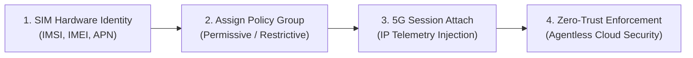

# 🚀 Prisma SASE 5G Management & Lifecycle Portal

[](https://github.com/jsuzanne/Prisma-SASE-5G/actions)
[](https://hub.docker.com/r/jsuzanne/prisma-5g-sase)
[](https://www.python.org/)
[](https://stratacloudmanager.paloaltonetworks.com)

> **🚀 Enterprise Demo & PoC Prototype**  
> Designed for trade shows (e.g., **SIDO Lyon**), customer innovation centers, and executive briefings to demonstrate **Palo Alto Networks Prisma SASE 5G** integrated with **Universal 5G Core networks** (Transatel NTT, Orange, Private 5G). Showcases agentless Zero-Trust mobile security, multi-industry IoT fleet simulation, and real-time UPF session telemetry.

<p align="center">
  
</p>

---

## ⚡ Quick Start (Docker Compose)

Launch the portal with persistent configuration in one command:

```bash
# Clone repository and start
git clone git@github.com:jsuzanne/Prisma-SASE-5G.git
cd Prisma-SASE-5G
docker compose up -d
```

Open **[http://localhost:8000](http://localhost:8000)**. Configure credentials directly via the **Settings ⚙️** tab (*automatically saved to `./config/` and preserved across container updates*).

<details>
<summary>💻 <b>Local Development Setup (without Docker)</b></summary>

```bash
# Create and activate virtual environment
python3 -m venv .venv && source .venv/bin/activate

# Install dependencies and launch
pip install -r requirements.txt
python3 app.py
```
</details>

---

## 🌟 Core Capabilities

### 1. 🏭 Multi-Vertical IoT Fleet Simulation
* **7 Industry Verticals**: *Smart City*, *Industry 4.0*, *Connected Healthcare*, *Logistics*, *Retail POS*, *Agritech*, and *Energy & Smart Grid*.
* **1-Click Auto-Enrich**: Overlay realistic IoT equipment names, badges, and icons onto existing SCM SIM inventory without modifying raw hardware payloads in SCM.
* **Dual View Mode**: Toggle seamlessly between **Industry Fleet View** and raw **SCM Hardware View**.

### 2. ⚡ Real-Time 5G Session Telemetry & UPF Injection
* **Agentless Zero-Trust**: Correlates mobile IP allocation (`10.56.0.0/24`) with subscriber IMSI/IMEI in Strata Cloud Manager without requiring local endpoint agents.
* **Live Session Event Console**: Visual streaming feedback of UPF session attach/detach REST transactions and latency metrics.

### 3. 🛡️ 5G Identity Groups & Quarantine Shifts
* **Dynamic Policy Groups**: Move devices instantly between security profiles (e.g., `Permissive` vs `Restrictive` quarantine).
* **System Protections**: Built-in safeguards preventing accidental deletion of core system groups.

### 4. 🔍 Live API Inspector & Offline Demo Engine
* **Real-Time API Debugger**: In-memory ring buffer capturing all outbound SCM transactions with response latencies and 1-click **Copy cURL** commands.
* **100% Offline Standalone Sandbox**: Complete zero-latency demo engine for presenting without active internet or SCM cloud connectivity.
* **Portable JSON Demo Packs**: 1-click export, import, and bulk SCM provisioning for repeatable trade show demos.

---

## 🔄 5G Lifecycle in 4 Steps



| Step | Action | Web UI | CLI (`manage_5g.py`) |
| :---: | :--- | :--- | :--- |
| **1** | **Register SIM** | *Add New SIM* (or quick presets) | `python3 manage_5g.py add --imsi <IMSI> --imei <IMEI>` |
| **2** | **Assign Group** | *Edit SIM* → Select Policy Group | `python3 manage_5g.py assign-group --ue-id <ID> --group-name "Permissive"` |
| **3** | **Attach Session**| Click *⚡ Attach* (auto IP CIDR pool) | `python3 manage_5g.py session-register --imsi <IMSI> --ipv4 10.56.0.200` |
| **4** | **Quarantine** | *Edit SIM* → Move to `Restrictive` | `python3 manage_5g.py assign-group --ue-id <ID> --group-name "Restrictive"` |

---

## 🛠️ CLI Quick Reference (`manage_5g.py`)

```bash
# Hierarchy & SIM Inventory
python3 manage_5g.py tenants                        # List TSG hierarchy
python3 manage_5g.py list                           # List registered SIM inventory
python3 manage_5g.py add --imsi <IMSI> --imei <IMEI> --apn sasetest

# Groups & Live Sessions
python3 manage_5g.py groups                         # List 5G subscriber groups
python3 manage_5g.py session-register --imsi <IMSI> --ipv4 10.56.0.200
python3 manage_5g.py session-terminate --imsi <IMSI> --ipv4 10.56.0.200

# Telemetry & Diagnostics
python3 manage_5g.py summary                        # SCM 5G KPI summary metrics
python3 manage_5g.py debug-logs --limit 20          # Recent API inspector transactions
```

---

## 🧪 Testing & Verification

```bash
# Run full automated test suite (71 unit tests)
./.venv/bin/python -m unittest discover tests -v

# Run 8-step automated lifecycle test
python3 test_lifecycle.py
```

---

## 📚 Documentation & Architecture Guides

* 📖 **Interactive REST API (Swagger)**: Available at `http://localhost:8000/docs`
* 📑 [Operational Modes, Demo Packs & Offline Engine](docs/OFFLINE_DEMO_AND_DEMO_PACKS.md)
* 🛡️ [5G Zero-Trust Security Groups & Quarantine Guide](docs/5G_ZERO_TRUST_SECURITY_GROUPS_GUIDE.md)
* 🎤 [SIDO Trade Show Demo Script (FR)](docs/DEMO_SCRIPT_CIO_STAND.FR.md) / [Demo Script (EN)](docs/DEMO_SCRIPT_CIO_STAND.EN.md)

---

## 📖 References

* [Strata Cloud Manager Portal](https://stratacloudmanager.paloaltonetworks.com)
* [Configure Prisma SASE 5G Documentation](https://docs.paloaltonetworks.com/sase/prisma-sase-multitenant-platform/manage-sase-5g/config-sase-5g)
* [Palo Alto Networks pan.dev SASE 5G API Reference](https://pan.dev/sase/api/manage-services-5g/post-mt-manage-5-g-register-ue/)
