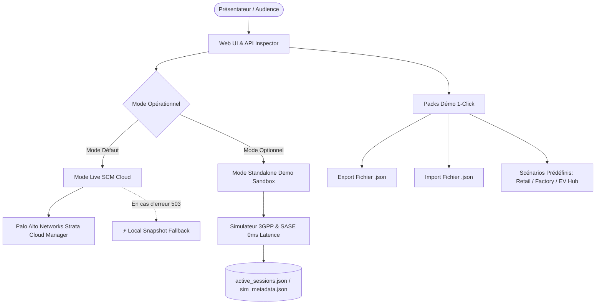

# 📦 Guide des Modes Opérationnels, Packs Démo 1-Click & Résilience Offline (v2.3.4)

Ce document détaille le fonctionnement des **modes opérationnels** (Live SCM Cloud vs Standalone Sandbox), la gestion des **Packs Démo 1-Click (Export/Import JSON)** et les mécanismes de **résilience et réconciliation réseau** de Prisma SASE 5G Manager.

---

## 🎯 Vue d'Ensemble & Objectifs

Lors de salons professionnels (ex: **SIDO Lyon**, **Mobile World Congress**), de démonstrations client ou de POCs en environnement déconnecté, les présentateurs et Sales Engineers (SE) sont souvent confrontés à deux défis majeurs :
1. **Absence de connectivité internet** ou réseau Wi-Fi de salon saturé/instable.
2. **Indisponibilité temporaire des microservices Cloud** (ex: erreurs HTTP `503 Service Unavailable` ou `no healthy upstream`).

Prisma SASE 5G intègre une architecture résiliente à double moteur permettant de garantir des démonstrations fluides, interactives et réalistes en toutes circonstances.

---

## ⚙️ 1. Les Modes Opérationnels

Le mode actif est sélectionnable dans l'onglet **Settings ➔ Operational Engine & Mode**.

### A. Mode Live SCM Cloud API *(Mode par défaut)*
* **Indicateur visuel** : Pilule verte émeraude **`SCM Online`** dans la barre supérieure.
* **Fonctionnement** : Toutes les opérations (inventaire, création de SIM, groupes de sécurité, attachement de session 5G) sont envoyées en temps réel via HTTPS à l'API Palo Alto Networks Strata Cloud Manager (`https://api.sase.paloaltonetworks.com`) avec authentification OAuth2 Bearer Token.
* **Inspecteur d'API** : Affiche les véritables temps de réponse du Cloud (~180ms - 350ms) et les payloads JSON retournés par SCM.

### B. Mode Standalone Demo Sandbox *(100% Offline)*
* **Indicateur visuel** : Pilule cyan **`⚡ Standalone Demo`** et badge **`⚡ Standalone Sandbox`** dans les modales.
* **Fonctionnement** : Aucun appel réseau externe n'est émis. Le moteur simule instantanément (~20ms) les réponses conformes aux spécifications 3GPP et Palo Alto Networks :
  - Découverte multitenant TSG (`Root MSP` et tenants enfants).
  - Validation et état de la liaison Interconnect (`europe-west9`, 100 Mbps Up).
  - Enregistrement / Déréférencement de session UPF (`200 OK Accepted`).
  - Déplacement de SIMs entre groupes de sécurité (`Permissive` vs `Restrictive`).
* **Inspecteur d'API** : Continue d'enregistrer en direct les requêtes HTTP simulées et génère les commandes cURL complètes pour la projection devant l'audience.

---

## 🧰 2. Packs Démo 1-Click (Export, Import & Scénarios)

Accessible via le bouton **`Demo Packs`** dans la barre d'outils de l'inventaire SIM.

### 📥 A. Export de Flotte (.json)
Génère et télécharge un fichier `prisma_5g_demo_pack.json` autonome contenant :
* La liste complète des SIMs avec leurs IMSIs, IMEIs et APNs.
* Les métadonnées d'enrichissement métier (labels, types de terminaux, icônes, verticales).
* Les adresses IP des sessions 5G actives (`active_sessions.json`).
* Les affectations aux groupes de sécurité.

### 📤 B. Import de Flotte (.json)
Permet d'importer par glisser-déposer n'importe quel pack démo `.json`. La topologie 5G est restaurée en 1 seconde.

### 🚀 C. Scénarios Prêts à l'Emploi Intégrés

| Scénario | Description & Équipements Inclus | Adresses IP Allouées |
| :--- | :--- | :--- |
| 🛒 **Retail & Smart POS** | 14 SIMs : Terminaux de paiement Ingenico Move 5000 / Desk 2600, douchettes code-barres Zebra TC58, portiques RFID Nedap EAS. | `10.56.0.193` à `10.56.0.202` |
| 🏭 **Smart Factory 4.0** | Robots mobiles autonomes MiR250 AGV, automates Siemens S7-1500, bras robotisés Fanuc M-20iD, caméras d'inspection IA Cognex. | `10.56.0.193` à `10.56.0.201` |
| ⚡ **EV Charging Infrastructure** | Bornes de recharge rapide DC 350kW Kempower, bornes AC Schneider EVlink, passerelles de paiement centralisées OCPP. | `10.56.0.193` à `10.56.0.198` |

---

## 🔄 3. Scénario de Reconnexion Réseau (Transition Offline ➔ Online)

Lorsque la connectivité internet ou l'accès aux microservices SCM est rétabli :

1. **Activation du mode Live** :
   Dans **Settings**, cochez **Live SCM Cloud API (Default)**.
2. **Ré-authentification OAuth2 automatique** :
   L'application négocie un nouveau jeton d'accès auprès du serveur d'authentification Palo Alto Networks.
3. **Synchronisation transparente (`refreshAll()`)** :
   - **Inventaire SIM** : Rechargé depuis les API SCM en conservant vos labels métiers locaux.
   - **Groupes d'utilisateurs** : Rechargés depuis Strata Cloud Manager.
   - **Session Telemetry** : Les prochaines actions d'Attach/Detach injecteront directement la télémétrie dans le cloud SCM en temps réel.
4. **Protection Anti-503 (Graceful Fallback)** :
   Si le cloud subit une micro-coupure temporaire (*no healthy upstream*), l'application bascule automatiquement et silencieusement sur le snapshot local avec la mention `⚡ Local Snapshot`, évitant tout écran blanc ou message d'erreur bloquant.

---

## 🛠️ 4. Endpoints API Dédiés

| Méthode | Endpoint | Description |
| :---: | :--- | :--- |
| `GET` | `/api/mode` | Retourne le mode actuel (`live` ou `standalone`). |
| `POST` | `/api/mode` | Bascule le mode (`{"standalone_mode": true/false}`). Persisté dans `config.json` et `.env`. |
| `GET` | `/api/demo/export` | Télécharge le pack démo complet en JSON. |
| `POST` | `/api/demo/import` | Importe et applique un pack démo JSON. |
| `GET` | `/api/demo/presets` | Liste les 3 scénarios prédéfinis (Retail, Factory, EV Hub). |
| `POST` | `/api/demo/presets/load/{preset_id}` | Active instantanément un scénario prédéfini. |
