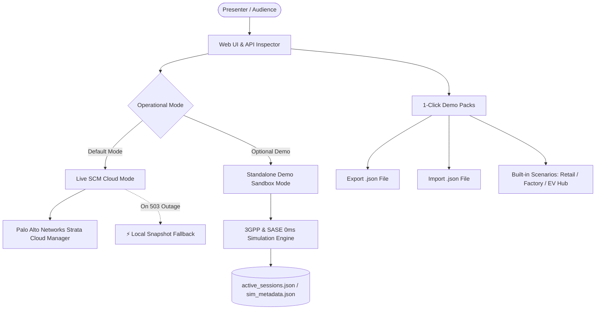

# 📦 Operational Modes, 1-Click Demo Packs & Offline Resilience Guide (v2.3.4)

This document provides a comprehensive overview of the **operational modes** (Live SCM Cloud vs Standalone Sandbox), **1-Click Demo Packs (JSON Export/Import & Presets)**, and the **network resilience & auto-reconciliation engine** in Prisma SASE 5G Manager.

---

## 🎯 Overview & Key Objectives

During major trade shows (e.g., **SIDO Lyon**, **Mobile World Congress**), customer innovation center briefings, or on-site client PoCs, sales engineers and solution architects frequently encounter two critical operational challenges:
1. **Unreliable or absent internet connectivity** (e.g., congested venue Wi-Fi, air-gapped corporate networks).
2. **Temporary cloud microservice outages** (e.g., HTTP `503 Service Unavailable` or `no healthy upstream` during backend maintenance).

Prisma SASE 5G Manager incorporates a resilient dual-engine architecture designed to deliver uninterrupted, realistic, and interactive 5G security demonstrations under any conditions.

---

## ⚙️ 1. Operational Modes

The active operational engine can be toggled at any time in **Settings ➔ Operational Engine & Mode**.

### A. Live SCM Cloud API Mode *(Strict Default)*
* **Visual Indicator**: Emerald green pill **`SCM Online`** in the top navigation bar.
* **Architecture**: Every action (SIM inventory listing, SIM provisioning, subscriber security group management, 5G session attach/detach) is dispatched in real-time via HTTPS to the official Palo Alto Networks Strata Cloud Manager API (`https://api.sase.paloaltonetworks.com`) authenticated with OAuth2 Bearer Tokens.
* **Live API Inspector**: Displays authentic Strata Cloud Manager HTTP response latencies (~180ms – 350ms), status codes, and JSON response bodies.

### B. Standalone Demo Sandbox Mode *(100% Offline)*
* **Visual Indicator**: Cyan pill **`⚡ Standalone Demo`** and dynamic **`⚡ Standalone Sandbox`** badges in dialogs.
* **Architecture**: No outbound network requests are dispatched to external cloud endpoints. The internal engine synthesizes immediate (~20ms) responses fully compliant with 3GPP and Palo Alto Networks specifications:
  - Multitenant TSG discovery (`Root MSP` and child tenants).
  - Interconnect link status and telemetry (`europe-west9`, 100 Mbps Up).
  - UPF session attach/detach operations (`200 OK Accepted`).
  - Subscriber security policy group modifications (`Permissive` vs `Restrictive`).
* **Live API Inspector**: Captures simulated HTTP transactions and generates authentic cURL commands with full headers and payloads for live projection to client audiences.

---

## 🧰 2. 1-Click Demo Packs (Export, Import & Built-in Scenarios)

Accessible via the **`Demo Packs`** button in the SIM Inventory toolbar.

### 📥 A. Fleet Export (.json)
Generates and downloads a self-contained `prisma_5g_demo_pack.json` archive containing:
* Complete SIM card inventory with IMSIs, IMEIs, and APNs.
* Business vertical metadata overlays (device labels, equipment categories, icons, verticals).
* Active 5G session IP allocations (`active_sessions.json`).
* Subscriber security group mappings and policy assignments.

### 📤 B. Fleet Import (.json)
Allows instant drag-and-drop or file upload of any previously exported Demo Pack `.json` file to restore the entire 5G topology in under one second.

### 🚀 C. Built-in Trade Show Scenarios

| Scenario | Description & Included Equipment | Allocated IP Pool |
| :--- | :--- | :--- |
| 🛒 **Retail & Smart POS** | 14 SIMs: Ingenico Move 5000 / Desk 2600 payment terminals, Zebra TC58 barcode scanners, Nedap EAS RFID anti-theft gates. | `10.56.0.193` to `10.56.0.202` |
| 🏭 **Smart Factory 4.0** | Autonomous Mobile Robots (MiR250 AGVs), Siemens S7-1500 PLCs, Fanuc M-20iD robotic arms, Cognex AI visual inspection cameras. | `10.56.0.193` to `10.56.0.201` |
| ⚡ **EV Charging Infrastructure** | Kempower 350kW DC ultra-fast chargers, Schneider EVlink AC destination chargers, OCPP central payment gateways. | `10.56.0.193` to `10.56.0.198` |

---

## 🔄 3. Network Reconnection Workflow (Offline ➔ Online Transition)

When internet connectivity or access to Strata Cloud Manager microservices is restored:

1. **Enable Live Mode**:
   In **Settings**, select **Live SCM Cloud API (Default)**.
2. **Automatic OAuth2 Re-Authentication**:
   The portal securely acquires a fresh OAuth2 access token from `auth.apps.paloaltonetworks.com`.
3. **Seamless Data Reconciliation (`refreshAll()`)**:
   - **SIM Inventory**: Refreshed from live SCM cloud APIs while preserving all local business labels and icons.
   - **User Security Groups**: Synchronized directly with Strata Cloud Manager.
   - **Session Telemetry**: Subsequent Attach/Detach actions immediately inject real REST user-plane telemetry into SCM.
4. **Anti-503 Graceful Fallback**:
   If the cloud microservices experience intermittent disruptions (*no healthy upstream*), the system automatically serves local snapshots (`⚡ Local Snapshot`), preventing any demo interruption or error screens.

---

## 🛠️ 4. Dedicated REST API Endpoints

| Method | Endpoint | Description |
| :---: | :--- | :--- |
| `GET` | `/api/mode` | Retrieve current operational mode (`live` vs `standalone`). |
| `POST` | `/api/mode` | Switch operational mode (`{"standalone_mode": true/false}`). Persisted in `config.json` and `.env`. |
| `GET` | `/api/demo/export` | Download complete fleet state as a standalone JSON Demo Pack. |
| `POST` | `/api/demo/import` | Import and apply a complete JSON Demo Pack. |
| `GET` | `/api/demo/presets` | List available built-in scenarios (Retail, Smart Factory, EV Hub). |
| `POST` | `/api/demo/presets/load/{preset_id}` | Instantly load and activate a built-in scenario preset. |
