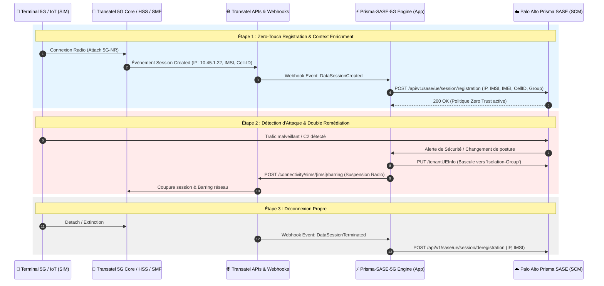

# PRD: Transatel NTT 5G Core x Palo Alto Networks Prisma SASE Integration

**Document Version:** 1.0.0  
**Status:** DRAFT / CONFIDENTIAL  
**Target Delivery:** Q4 2026 / SIDO 2026  
**Author:** Technical Architecture & Product Engineering  

---

## 1. Executive Summary & Vision

### 1.1 Contexte & Problématique
Le déploiement massif de flottes cellulaires 5G/LTE pour l'IoT et l'OT industriel (AGV, caméras 4K nomades, capteurs SCADA, routeurs 5G véhiculaires) se heurte à un verrou opérationnel et sécuritaire majeur :
1. **Absence d'agent logiciel :** Les systèmes embarqués et automates industriels ne peuvent pas exécuter d'agents Endpoint (ex: GlobalProtect, EDR).
2. **Visibilité cloisonnée (Silos NetOps vs SecOps) :** Les équipes réseau gèrent les cartes SIM chez l'opérateur (Transatel), tandis que les équipes de sécurité gèrent les politiques d'accès (Palo Alto Prisma SASE) sans corrélation temps réel.
3. **Risques cyber accrus :** En cas d'infection ou d'usurpation de SIM, le SOC est incapable d'isoler physiquement le terminal au niveau radio.

### 1.2 Solution & Vision Produit
Construire un **connecteur d'intégration bidirectionnel en temps réel** entre les **APIs Transatel NTT** et **Palo Alto Networks Prisma SASE (Strata Cloud Manager)**.

* **Zero-Touch Provisioning :** Dès qu'un modem 5G s'allume avec une SIM Transatel, la session de données est automatiquement enregistrée et enrichie dans Prisma SASE avec l'application immédiate de la politique Zero Trust associée.
* **Full-Stack Security Remediation :** Si Prisma SASE détecte une menace critique (C2, malware, exfiltration), l'administrateur ou le SOAR peut isoler le trafic applicatif ET suspendre la SIM au niveau opérateur (Barring) en 1 clic.

---

## 2. Architecture Globale & Flux de Données



---

## 3. Spécifications Détaillées des Appels API

### 3.1 APIs Transatel NTT (Consommateur : Notre Application)

#### A. Authentification OAuth 2.0
* **Endpoint :** `POST https://api.transatel.com/authentication/api/v1/oauth/token`
* **Headers :** `Content-Type: application/x-www-form-urlencoded`
* **Request Body :**
  ```
  grant_type=client_credentials&client_id={{TRANSATEL_CLIENT_ID}}&client_secret={{TRANSATEL_CLIENT_SECRET}}
  ```
* **Response (200 OK) :**
  ```json
  {
    "access_token": "eyJhbGciOiJSUzI1NiIsIn...",
    "token_type": "Bearer",
    "expires_in": 3600
  }
  ```

---

#### B. Récupération des Sessions de Données Actives (Data Session API)
* **Endpoint :** `GET https://api.transatel.com/network/v1/data-sessions`
* **Query Params :** `limit=100`, `status=ACTIVE`
* **Headers :** `Authorization: Bearer {{token}}`
* **Response (200 OK) :**
  ```json
  {
    "total": 42,
    "sessions": [
      {
        "imsi": "208010000000001",
        "iccid": "8933100000000000001F",
        "imei": "860123045678901",
        "ipAddress": "10.45.1.22",
        "apn": "iot.transatel.com",
        "ratType": "5G-NR",
        "cellId": "208-01-A1B2C-01",
        "mccMnc": "20801",
        "country": "FRA",
        "startedAt": "2026-09-17T14:30:00Z"
      }
    ]
  }
  ```

---

#### C. Réception des Événements Réseau (Webhooks Transatel)
* **Webhook Inbound Endpoint (FastAPI) :** `POST /api/v1/transatel/webhook`
* **Headers :** `X-TSL-Signature: sha256=...`
* **Payload reçu (Exemple : Connexion Terminal) :**
  ```json
  {
    "eventType": "DATA_SESSION_CREATED",
    "timestamp": "2026-09-17T15:00:00Z",
    "data": {
      "imsi": "208010000000001",
      "imei": "860123045678901",
      "ipAddress": "10.45.1.22",
      "cellId": "208-01-A1B2C-01",
      "apn": "iot.transatel.com",
      "ratType": "5G-NR"
    }
  }
  ```

---

#### D. Inventaire SIM & État du Parc (SIM Management API)
* **Endpoint :** `GET https://api.transatel.com/connectivity/v1/sims`
* **Query Params :** `status=ACTIVE`, `page=1`, `size=50`
* **Response (200 OK) :**
  ```json
  {
    "data": [
      {
        "iccid": "8933100000000000001F",
        "imsi": "208010000000001",
        "msisdn": "+33612345678",
        "status": "ACTIVE",
        "type": "eSIM",
        "ratePlan": "IOT_5G_UNLIMITED_FR"
      }
    ]
  }
  ```

---

#### E. Suspension / Barring Opérateur (Remédiation d'Urgence)
* **Endpoint :** `POST https://api.transatel.com/connectivity/v1/sims/{imsi}/barring`
* **Headers :** `Authorization: Bearer {{token}}`, `Content-Type: application/json`
* **Request Body :**
  ```json
  {
    "service": "DATA",
    "action": "BAR",
    "reason": "SECURITY_QUARANTINE_PRISMA_SASE"
  }
  ```
* **Response (202 Accepted) :**
  ```json
  {
    "requestId": "TSL-REQ-987654321",
    "status": "IN_PROGRESS"
  }
  ```

---

### 3.2 APIs Palo Alto Networks Prisma SASE (Strata Cloud Manager)

#### A. Inscription de Session UE (Session Registration)
* **Endpoint :** `POST {{SCM_BASE_URL}}/api/v1/sase/ue/session/registration`
* **Headers :** `Authorization: Bearer {{PANW_TOKEN}}`
* **Request Body :**
  ```json
  {
    "imsi": "208010000000001",
    "ipAddress": "10.45.1.22",
    "imei": "860123045678901",
    "cellId": "208-01-A1B2C-01",
    "mcc": "208",
    "mnc": "01",
    "ratType": "5G-NR",
    "apn": "iot.transatel.com"
  }
  ```

---

#### B. Désenregistrement de Session UE (Session Deregistration)
* **Endpoint :** `POST {{SCM_BASE_URL}}/api/v1/sase/ue/session/deregistration`
* **Headers :** `Authorization: Bearer {{PANW_TOKEN}}`
* **Request Body :**
  ```json
  {
    "imsi": "208010000000001",
    "ipAddress": "10.45.1.22"
  }
  ```

---

#### C. Création / Mise à jour de Mapping UE (Tenant UE Info)
* **Endpoint :** `POST {{SCM_BASE_URL}}/api/v1/sase/tenantUEInfo/create`
* **Request Body :**
  ```json
  {
    "imsi": "208010000000001",
    "imei": "860123045678901",
    "ueId": "AGV-ROBOT-LYON-01",
    "userGroup": "5G_AGV_Fleet_Permissive",
    "deviceType": "Industrial AGV",
    "tags": ["Transatel", "Site-Lyon-Factory"]
  }
  ```

---

## 4. Fonctionnalités & User Stories à Développer

### Feature 1 : Module Connecteur Transatel (`src/transatel_client.py`)
* **US-1.1 :** En tant que système, je dois m'authentifier auprès de Transatel via OAuth 2.0 et rafraîchir le token automatiquement avant expiration.
* **US-1.2 :** En tant qu'administrateur, je peux tester la connectivité avec l'API Transatel depuis les Settings de l'UI.
* **US-1.3 :** En tant que développeur, un mode Sandbox/Mock Transatel doit être disponible si les identifiants ne sont pas renseignés.

### Feature 2 : Réception Webhook & Auto-Registration Zero-Touch
* **US-2.1 :** En tant que système, je reçois les événements `DATA_SESSION_CREATED` sur `/api/v1/transatel/webhook` et j'appelle immédiatement `client.register_session()` dans Prisma SASE.
* **US-2.2 :** En tant que système, je reçois `DATA_SESSION_TERMINATED` et j'appelle `client.deregister_session()`.

### Feature 3 : Import & Synchronisation d'Inventaire SIM
* **US-3.1 :** En tant qu'administrateur, je dispose d'un bouton *"Sync Transatel Fleet"* dans l'UI pour importer toutes les SIMs actives en tant que `Tenant UE Mappings`.
* **US-3.2 :** Les métadonnées opérateur (ICCID, Type de forfait, Date d'activation) sont affichées dans la fiche de chaque terminal.

### Feature 4 : Double Remédiation de Sécurité (Full-Stack Isolation)
* **US-4.1 :** Dans la table des sessions et des terminaux, un bouton d'action *"Emergency Radio Barring"* permet de suspendre la data de la SIM chez Transatel.
* **US-4.2 :** En cas de bascule d'un terminal vers le groupe `Quarantine` ou `Isolation`, proposer une case à cocher pour suspendre la SIM côté opérateur en même temps.

---

## 5. Plan de Développement & Jalons (Milestones)

| Jalon | Périmètre | Livrables |
| :--- | :--- | :--- |
| **Milestone 1** | Client API Transatel & Mocks | `src/transatel_client.py`, tests unitaires `test_transatel_client.py`, mode simulation. |
| **Milestone 2** | Endpoint Webhook & Auto-Enrichment | Route FastAPI `/api/v1/transatel/webhook`, pipeline temps réel vers `src/client.py`. |
| **Milestone 3** | Interface Web & Synchronisation SIM | Bouton d'import dans l'UI (`index.html`), badges Transatel 5G, logs d'événements opérateur. |
| **Milestone 4** | Action de Barring & Tests E2E | Intégration du Barring d'urgence, tests de bout en bout et documentation de démo SIDO. |

---

## 6. Sécurité & Résilience

1. **Gestion des Secrets :** Stockage sécurisé de `TRANSATEL_CLIENT_ID` et `TRANSATEL_CLIENT_SECRET` dans `.env` et masquage dans l'interface et les logs API.
2. **Signature Webhook :** Validation obligatoire de la signature `X-TSL-Signature` (HMAC SHA-256) pour éviter l'injection de fausses sessions.
3. **Gestion des Pannes :** En cas d'indisponibilité de l'API Transatel, mécanisme de retry exponentiel et fallback sur cache local des sessions.
