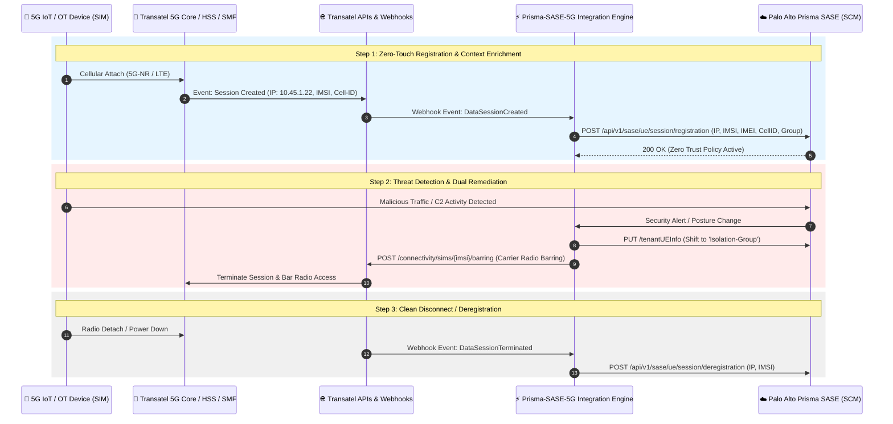

# PRD: Transatel NTT 5G Core x Palo Alto Networks Prisma SASE Integration

**Document Version:** 1.0.0  
**Status:** DRAFT / CONFIDENTIAL  
**Target Delivery:** Q4 2026 / SIDO 2026  
**Author:** Technical Architecture & Product Engineering  

---

## 1. Executive Summary & Vision

### 1.1 Context & Problem Statement
The massive rollout of cellular 5G/LTE fleets for IoT and industrial OT environments (autonomous mobile robots / AGVs, nomadic 4K surveillance cameras, SCADA telemetry probes, connected vehicular routers) faces major operational and security roadblocks:
1. **Agentless Architecture:** Embedded systems and industrial PLCs/RTUs cannot host conventional Endpoint software agents (e.g., GlobalProtect, EDR).
2. **Siloed Visibility (NetOps vs. SecOps):** Network teams manage SIM cards and data plans within carrier portals (Transatel NTT), whereas security teams enforce corporate access policies within Prisma SASE without real-time synchronization.
3. **Cybersecurity Exposure & Incident Response:** In the event of malware infection, botnet enlistment (e.g., Mirai), or SIM hijacking, SOC teams lack the capability to physically isolate or disconnect the endpoint at the cellular radio level.

### 1.2 Solution & Product Vision
Build a **real-time bidirectional integration connector** bridging the **Transatel NTT APIs** and **Palo Alto Networks Prisma SASE (Strata Cloud Manager)**.

* **Agentless Zero-Touch Provisioning:** As soon as a 5G cellular modem boots with an active Transatel SIM, the data session is automatically registered and enriched in Prisma SASE, immediately activating the associated 5G Zero Trust security policy.
* **Full-Stack Security Remediation:** When Prisma SASE detects critical threats (C2 beaconing, malware, abnormal exfiltration), the SOC administrator or SOAR playbook can instantly quarantine the endpoint at the SASE layer AND trigger a cellular radio suspension (SIM Barring) at the carrier level in a single click.

---

## 2. Architecture & Data Flow



---

## 3. Detailed API Specifications

### 3.1 Transatel NTT APIs (Inbound / Consumed by Integration Engine)

#### A. OAuth 2.0 Authentication
* **Endpoint:** `POST https://api.transatel.com/authentication/api/v1/oauth/token`
* **Headers:** `Content-Type: application/x-www-form-urlencoded`
* **Request Body:**
  ```
  grant_type=client_credentials&client_id={{TRANSATEL_CLIENT_ID}}&client_secret={{TRANSATEL_CLIENT_SECRET}}
  ```
* **Response (200 OK):**
  ```json
  {
    "access_token": "eyJhbGciOiJSUzI1NiIsIn...",
    "token_type": "Bearer",
    "expires_in": 3600
  }
  ```

---

#### B. Active Data Sessions Retrieval (Data Session API)
* **Endpoint:** `GET https://api.transatel.com/network/v1/data-sessions`
* **Query Params:** `limit=100`, `status=ACTIVE`
* **Headers:** `Authorization: Bearer {{token}}`
* **Response (200 OK):**
  ```json
  {
    "total": 42,
    "sessions": [
      {
        "imsi": "208010000000001",
        "iccid": "8933100000000000001F",
        "imei": "860123045678901",
        "ipAddress": "10.45.1.22",
        "apn": "iot.transatel.com",
        "ratType": "5G-NR",
        "cellId": "208-01-A1B2C-01",
        "mccMnc": "20801",
        "country": "FRA",
        "startedAt": "2026-09-17T14:30:00Z"
      }
    ]
  }
  ```

---

#### C. Network Event Notification (Transatel Webhooks)
* **Webhook Receiver (FastAPI):** `POST /api/v1/transatel/webhook`
* **Headers:** `X-TSL-Signature: sha256=...`
* **Payload Sample (Device Connected Event):**
  ```json
  {
    "eventType": "DATA_SESSION_CREATED",
    "timestamp": "2026-09-17T15:00:00Z",
    "data": {
      "imsi": "208010000000001",
      "imei": "860123045678901",
      "ipAddress": "10.45.1.22",
      "cellId": "208-01-A1B2C-01",
      "apn": "iot.transatel.com",
      "ratType": "5G-NR"
    }
  }
  ```

---

#### D. SIM Inventory & Lifecycle Management (SIM Management API)
* **Endpoint:** `GET https://api.transatel.com/connectivity/v1/sims`
* **Query Params:** `status=ACTIVE`, `page=1`, `size=50`
* **Response (200 OK):**
  ```json
  {
    "data": [
      {
        "iccid": "8933100000000000001F",
        "imsi": "208010000000001",
        "msisdn": "+33612345678",
        "status": "ACTIVE",
        "type": "eSIM",
        "ratePlan": "IOT_5G_UNLIMITED_FR"
      }
    ]
  }
  ```

---

#### E. Carrier-Level Emergency Barring (Remediation API)
* **Endpoint:** `POST https://api.transatel.com/connectivity/v1/sims/{imsi}/barring`
* **Headers:** `Authorization: Bearer {{token}}`, `Content-Type: application/json`
* **Request Body:**
  ```json
  {
    "service": "DATA",
    "action": "BAR",
    "reason": "SECURITY_QUARANTINE_PRISMA_SASE"
  }
  ```
* **Response (202 Accepted):**
  ```json
  {
    "requestId": "TSL-REQ-987654321",
    "status": "IN_PROGRESS"
  }
  ```

---

### 3.2 Palo Alto Networks Prisma SASE APIs (Strata Cloud Manager)

#### A. UE Session Registration
* **Endpoint:** `POST {{SCM_BASE_URL}}/api/v1/sase/ue/session/registration`
* **Headers:** `Authorization: Bearer {{PANW_TOKEN}}`
* **Request Body:**
  ```json
  {
    "imsi": "208010000000001",
    "ipAddress": "10.45.1.22",
    "imei": "860123045678901",
    "cellId": "208-01-A1B2C-01",
    "mcc": "208",
    "mnc": "01",
    "ratType": "5G-NR",
    "apn": "iot.transatel.com"
  }
  ```

---

#### B. UE Session Deregistration
* **Endpoint:** `POST {{SCM_BASE_URL}}/api/v1/sase/ue/session/deregistration`
* **Headers:** `Authorization: Bearer {{PANW_TOKEN}}`
* **Request Body:**
  ```json
  {
    "imsi": "208010000000001",
    "ipAddress": "10.45.1.22"
  }
  ```

---

#### C. Tenant UE Mapping Provisioning (Tenant UE Info)
* **Endpoint:** `POST {{SCM_BASE_URL}}/api/v1/sase/tenantUEInfo/create`
* **Request Body:**
  ```json
  {
    "imsi": "208010000000001",
    "imei": "860123045678901",
    "ueId": "AGV-ROBOT-LYON-01",
    "userGroup": "5G_AGV_Fleet_Permissive",
    "deviceType": "Industrial AGV",
    "tags": ["Transatel", "Site-Lyon-Factory"]
  }
  ```

---

## 4. User Stories & Functional Requirements

### Feature 1: Transatel API Client Module (`src/transatel_client.py`)
* **US-1.1:** As a system, I must authenticate against Transatel OAuth 2.0 and automatically renew the access token prior to expiration.
* **US-1.2:** As an administrator, I can test connectivity with the Transatel API directly from the web settings interface.
* **US-1.3:** As a developer, a realistic Sandbox / Mock simulation mode must operate if credentials are not configured.

### Feature 2: Inbound Webhook & Zero-Touch Auto-Registration
* **US-2.1:** As a system, when receiving `DATA_SESSION_CREATED` on `/api/v1/transatel/webhook`, immediately trigger `client.register_session()` in Prisma SASE.
* **US-2.2:** As a system, when receiving `DATA_SESSION_TERMINATED`, immediately invoke `client.deregister_session()`.

### Feature 3: SIM Inventory Auto-Discovery & Fleet Sync
* **US-3.1:** As an administrator, provide a *"Sync Transatel Fleet"* action in the UI to discover and import active SIMs into `Tenant UE Mappings`.
* **US-3.2:** Display carrier telemetry attributes (ICCID, rate plan, SIM status) alongside device security postures.

### Feature 4: Full-Stack Security Remediation (SASE + Radio Barring)
* **US-4.1:** In the UI sessions table, provide an *"Emergency Radio Barring"* action to suspend cellular data access at the carrier level.
* **US-4.2:** When shifting an infected terminal to the `Quarantine` or `Isolation` group, provide an option to simultaneously trigger carrier-level radio barring.

---

## 5. Implementation Roadmap & Milestones

| Milestone | Scope | Deliverables |
| :--- | :--- | :--- |
| **Milestone 1** | Transatel API Client & Sandbox Mock | `src/transatel_client.py`, unit test suite `test_transatel_client.py`, simulation engine. |
| **Milestone 2** | Webhook Ingestion & Real-Time Sync | FastAPI endpoint `/api/v1/transatel/webhook`, live pipeline into `src/client.py`. |
| **Milestone 3** | UI Integration & SIM Fleet Sync | Dashboard synchronization button (`index.html`), Transatel 5G badges, carrier logs table. |
| **Milestone 4** | Threat Remediation & E2E Validation | Emergency barring workflow, automated integration tests, and SIDO demonstration playbook. |

---

## 6. Security, Resilience & Best Practices

1. **Secret Management:** Securely persist `TRANSATEL_CLIENT_ID` and `TRANSATEL_CLIENT_SECRET` via environment variables (`.env`) and redact all secrets in debug loggers.
2. **Webhook Cryptographic Validation:** Verify inbound webhook signatures (`X-TSL-Signature` HMAC SHA-256) to prevent malicious session injections.
3. **Fault Tolerance & Retries:** Implement exponential backoff on transient network failures and maintain a local session state cache in case of upstream carrier API timeouts.
